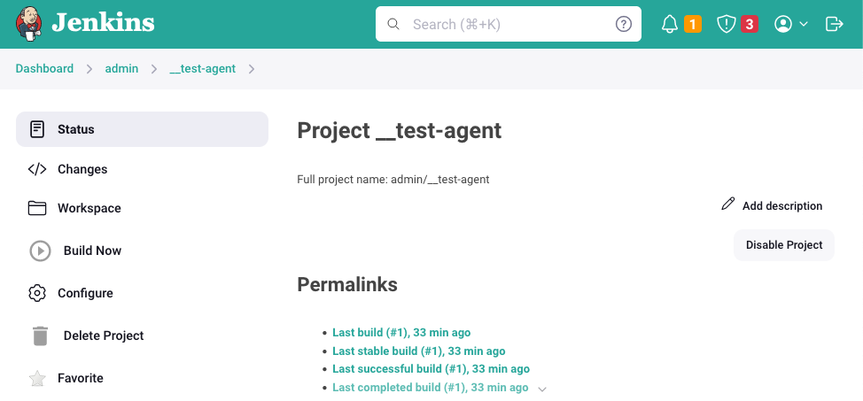

# JENKINS LOCAL

Automated CI/CD structure with jenkins and docker to test/validate your pipeline `locally`

## Getting started

1. Give it a try with this simple command

   `$ ./scripts/run.sh`

2. Go to your controller at [http://localhost:8787](http://localhost:8787)

   

3. Go to `admin > __test-agent` and Build the job

   

### Features

- Test your local commits before create a PR
- Jenkins controller with agent communication using docker
- Control everything you need on your own machine

## How to

### Enable ssh locally

- `Enable ssh in your Mac` - Required to make your host accept ssh connection

  - System preferences > Sharing > Remote Login

   

### Troubleshooting

1. `Error: Connection refused`
   - Error message: `stderr: ssh: connect to host host.docker.internal port 22: Connection refused`
   - If you are trying to run `__jenkins-jobs` job and get error, you can solve it by enabling your `remote login`

## Built With

- [Docker](https://www.docker.com/)  - Container platform
- [JCASC](https://www.jenkins.io/projects/jcasc/)  -  Jenkins configuration as code
- [docker-plugin](https://plugins.jenkins.io/docker-plugin/)  -  docker plugin for jenkins

## Author

- **Marcio Mendes** - [mmendesas](https://github.com/mmendesas)

## License

This project is licensed under the MIT License
