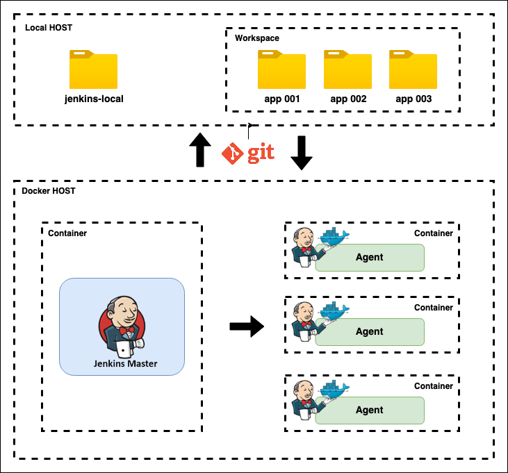
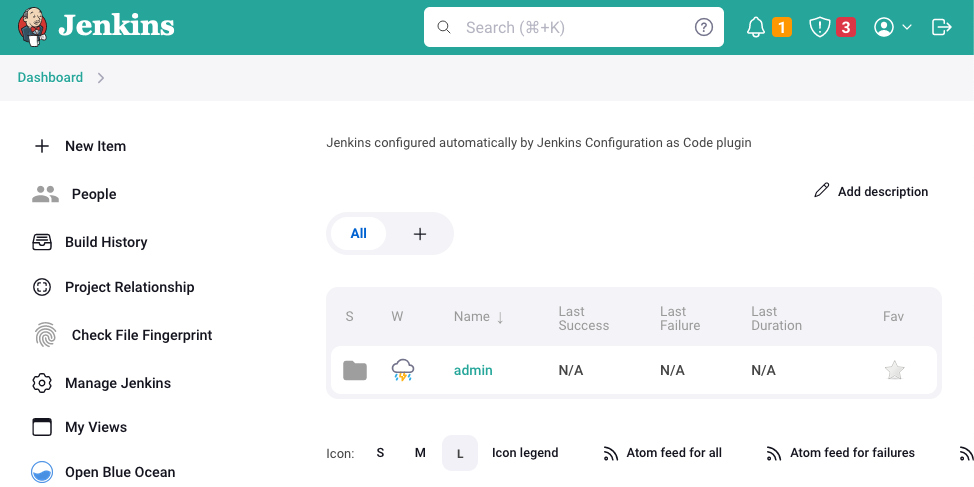
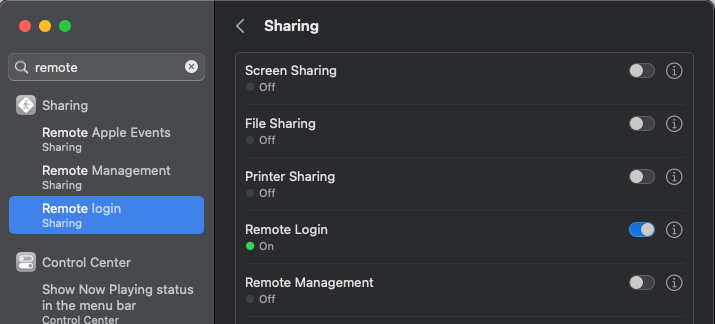

# JENKINS LOCAL

Automated CI/CD structure with jenkins and docker to test/validate your pipeline **`on your own machine`**

<ul>
   <li>Test out your local projects</li>
   <li>Define your agents based on your project stack</li>
   <li>Use main controller to manage everything (plugins, config etc)</li>
</ul>

## Getting started

1. Update `.env.jenkins` with your data using env.template

2. From `/jenkins-local` root folder, you can run the command:

   **`$ ./scripts/run.sh`**

3. Go to your controller at [http://localhost:8787](http://localhost:8787)

4. Open `admin > __jenkins-jobs` and Build the job

5. Go to `Dashboard` and you can see some examples

## How it works?

- The communication between containers and your local host is managed by exposing **docker-api**
- From containers you can read/fetch your local **app001/.git** project
- From **Jenkins Master** you can spin up an **Agent** to run your CI flow based on your project needs

### Features

- Test your local commits before create a PR
- Jenkins controller with agent communication using docker
- Multiple agents running in parallel
- Control everything you need on your own machine

## How to

### Enable ssh locally

- `Enable ssh in your Mac` - Required to make your host accept ssh connection
  - System preferences > Sharing > Remote Login
    

### Troubleshooting

1. `Error: Connection refused`
   - Error message: `stderr: ssh: connect to host host.docker.internal port 22: Connection refused`
   - If you are trying to run `__jenkins-jobs` job and get error, you can solve it by enabling your `remote login`

## Built With

- [Docker](https://www.docker.com/)  - Container platform
- [JCASC](https://www.jenkins.io/projects/jcasc/)  -  Jenkins configuration as code
- [docker-plugin](https://plugins.jenkins.io/docker-plugin/)  -  docker plugin for jenkins

## Author

- **Marcio Mendes** - [mmendesas](https://github.com/mmendesas)

## License

This project is licensed under the MIT License
